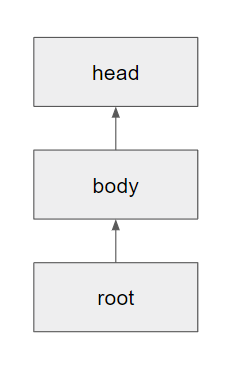

# Project - LinNet
---
## Abstract
Networks with residual units, such as ResNet had proven its use in various domain of AI such as image classification. However, the commonly used models, such as ResNetV2, BiT ensure some degree of "shorter pathes" between two layers, but it is restricted due to the construction of the residual connection with identity/downscale of the original inputs. In this project, the alternative version of ResNet, a LinNet is proposed for purpose of generalizing not only residual, but all the possible connections between the layers.

## LinNet - Main Ideas
---
Residual units are usually expressed in general form:

$y_l = h(x_l) + F(x_l, W_l),$

$x_l + 1 = f(y_l),$

Most of the models commonly use $h$ as an identity function, or downscale of the original input by convolution.

However, LinNet Model Uses a huge accumulation layer, or network to imitate this residual connection, and furthermore generalize the connection between layers.

Brief Mathematical Background
---
By some theorems like universal approximation theorem, neural networks with proper structure are "universal approximators". However, in various applications, it is shown that some of the huge models doesn't work due to some problems like vanishing gradient problems. Moreover, it is easy to show that increasing depth of network without enough width possibly force hypothesis space to become 'smaller'. With using skip/residual connection, it is well-known that it alleviate vanishing gradient problems. Furthermore, it is also easy to see that the problem of hypothesis space being smaller is also weaken with enough of those connections. Knowing that, it could be a considerable approach to generalize the skip/residual connections of the network.

How LinNet Works
---

Basic LinNet is composed of two parts: units and projection space.
Units are partial networks without residual connections, and projection space is a layer/network with larger than width of each unit.

each process of units are proceeded with 3 steps: projection of input, unit action, projection of output.

At "projection of input" stage, the the projection space is projected to the neurons of input of unit to pass the information.
Then, at "unit action" stage, the unit acts on input to produce the ouput of the unit.
At "projection of output" stage, the projected output to the projection space is aggregated with current state of the projection network, it can be simply done by addition for purpose of accumulation.

The update of network can be done by various ways. Two ways which will be introduced are "sequential update" and "simultaneous update"

In sequential update, units are ordered. At each stage of update, corresponding ordered units are called, and the process of unit is only called for that unit. At next stage the next unit would be called.

In simultaneous update, for each update, all the units are called for process, and they are updated simultaneously i.e. the projections occur simultaneously for each unit, both projections of input and projections of output.

Between each stage of update, the update rule can be used for processing added projection from outputs.

## LinNet50 - Network Architecture
---

LinNet50 is a network based on LinNet architecture, to briefly test its performance. Its configuration is based on ResNetV2, and BiT-r50x1(Big Transfer, Google Research). The model was tested on CIFAR-10 dataset downloaded from University of Toronto(www.cs.toronto.edu). With the application of LinNet, few interesting features were found.

Overall Architecture
---

The LinNet50 is consisted of three parts: root, body, and head.
Root is consisted of some sequence of layers including convolution to modify informations and get appropriate shape of data. Head is to do pooling for processed output of the body, interpreting the data to some readable forms. Body processed the information passed from root, and passes its projection layer to head after process, for pooling.

Head was composed with 10 output heads, which corresponds to the classes of CIFAR-10.

Building Blocks of Body
---

The body of the LinNet50 is constructed as above diagram. Using pytorch, it was unnatural to construct the architecture discussed above. Therefore it was made as this structure, preserving the mechanism of LinNet. It uses sequential update. $f$ denotes the unit action, and $L$ denotes the aggregation, which add was used, and identity function was used for update rule in LinNet50, which 'makes the projection network be network with no edges'.

Experiment : Freeze Learning
---
Using similar configuration to BiT, the pretrained weight of BiT models could be used for warmstarting the network. One intuition of this network was that it can learn the connection between layers. Therefore the experiment of "Freeze Learning" was done. Freeze Learning is a training method on LinNet, which the pretrained weights are fixed(freezed), and only the projections of inputs and outputs are trained. With this experiment, the network had shown some interesting features, which will be discussed on test result.

Test Result
---

Caution: Testing was done informally for few tries for purpose of briefly checking if the model works, so these testing results can be improper to be referred.

Model Used : LinNet50

Dataset Used : CIFAR-10

---
**Model Specification**
  
  Input : Image of [C, H, W] = [3, 32, 32]
  
  Output : Vector of shape [10,]

  Initialization
  - Default Initialization of PyTorch
  - Warmstarted with BiT-r50x1 model (See BiT from Google Research)

  Architecture
  
  Root
  - BiT model roots 
  
  Body
  - Units: Sequence of PreActConv
      - PreActConv : Similar to PreActBottleneck, but with no residual connection.
      - Unit 1: 3 Blocks, Unit 2: 4 Blocks, Unit 3: 6 Blocks, Unit 4: 3 Blocks
  - Projection Plane: Channel of 2048 * {width_factor}
    - Projection of outputs were done by StdConv of cout = 2048 * {width_factor}
  
  Head
  - BiT model heads with zero_head = True

---
**Result**

  Freeze Learning
  - Epoch 1: Training  Accuracy: 30%~ / Test Accuracy: 40%~
  - Epoch 3~5 : Training Accuracy: 60%~ / Test Accuracy: 60%~
  
  Melt Learning
  - Epoch 5~10: Training Accuracy: 75%~ / Test Accuracy: 75%~

---
Result shows that it reached above 75% of the accuracy on CIFAR-10, which was similar to the ResNetV2-r50x1 model from BiT that was trained on the same environment.

The optimizer was not well-configured, hence it affected the result.

By the result, it was shown that Freeze Learning on LinNet could effectively train the model. This suggest the possibility of LinNet to aggregate layers from more than 2 networks to form bigger network with proper configuration of updates and layers.

Conclusion
---
The model was shown effective to the CIFAR-10 image classification task.

LinNet architecture has a lot ways to diverge its configurations e.g. using networks instead of projection layer, continuous-time approach, etc.
Using Hopfield network and its update rule as projection space might be a considerable approach.

For purpose of combining multiple networks, LinNet might be a plausible option. Adding multiple roots and heads could be done.

---
**ALL RIGHTS RESERVED**

2023131031@yonsei.ac.kr
