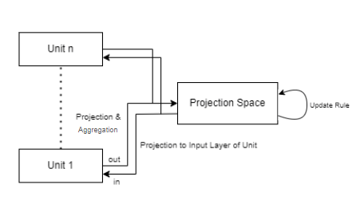
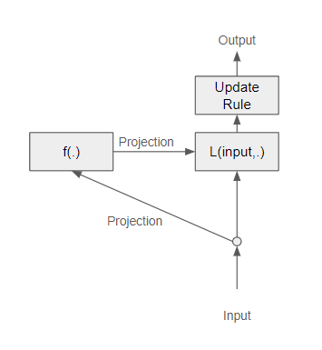

# Project - LinNet
---
## Abstract
Networks with residual units, such as ResNet had proven its use in various domain of AI such as image classification. However, the commonly used models, such as ResNetV2, BiT ensure some degree of "shorter pathes" between two layers, but it is restricted due to the construction of the residual connection with identity/downscale of the original inputs. In this project, the alternative version of ResNet, a LinNet is proposed for purpose of generalizing not only residual, but all the possible connections between the layers.

## LinNet - Main Ideas
---
Residual units are usually expressed in general form:

$y_l = h(x_l) + F(x_l, W_l),$

$x_l + 1 = f(y_l),$

Most of the models commonly use $h$ as an identity function, or downscale of the original input by convolution.

However, LinNet Model Uses a huge accumulation layer, or network to imitate this residual connection, and furthermore generalize the connection between layers.

Brief Mathematical Background
---
By some theorems like universal approximation theorem, neural networks with proper structure are "universal approximators". However, in various applications, it is shown that some of the huge models doesn't work due to some problems like vanishing gradient problems. Moreover, it is easy to show that increasing depth of network without enough width possibly force hypothesis space to become 'smaller'. With using skip/residual connection, it is well-known that it alleviate vanishing gradient problems. Furthermore, it is also easy to see that the problem of hypothesis space being smaller is also weaken with enough of those connections. Knowing that, it could be a considerable approach to generalize the skip/residual connections of the network.

How LinNet Works
---

Basic LinNet is composed of two parts: units and projection space.
Units are partial networks without residual connections, and projection space is a layer/network with larger than width of each unit.

each process of units are proceeded with 3 steps: projection of input, unit action, projection of output.

At "projection of input" stage, the the projection space is projected to the neurons of input of unit to pass the information.
Then, at "unit action" stage, the unit acts on input to produce the ouput of the unit.
At "projection of output" stage, the projected output to the projection space is aggregated with current state of the projection network, it can be simply done by addition for purpose of accumulation.

The update of network can be done by various ways. Two ways which will be introduced are "sequential update" and "simultaneous update"

In sequential update, units are ordered. At each stage of update, corresponding ordered units are called, and the process of unit is only called for that unit. At next stage the next unit would be called.

In simultaneous update, for each update, all the units are called for process, and they are updated simultaneously i.e. the projections occur simultaneously for each unit, both projections of input and projections of output.

Between each stage of update, the update rule can be used for processing added projection from outputs.

## LinNet - Network Architecture
---
Overall Architecture
---

Building Blocks
---

** ALL RIGHTS RESERVED **

2023131031@yonsei.ac.kr
